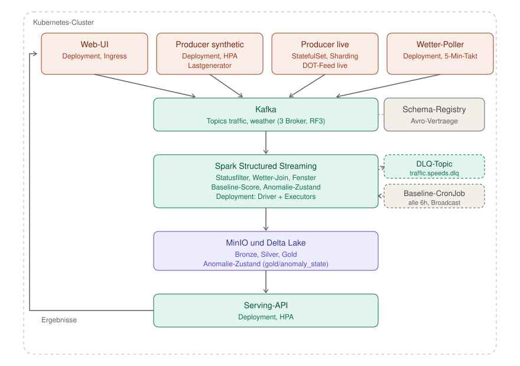

# NYC Congestion Watch

*Datengetriebener Stauerkennungsdienst auf Kubernetes*

## 1. Use Case und Motivation

### 1.1 Problemstellung

Die Verkehrsleitzentrale des NYC DOT steuert den Stadtverkehr anhand von
Sensor- und Kamerafeeds mehrerer Behörden. Die Datenmenge ist dabei nicht
das Ziel, sondern die Schwierigkeit: Aus einem kontinuierlichen Strom von
Messungen über hunderte Straßensegmente muss laufend die Handvoll
Segmente herausfallen, bei denen ein Eingriff lohnt. Bei Regen wird alles
langsamer, bei Feierabend auch — auffällig ist ein Segment erst dann,
wenn es langsamer ist, als die Umstände erklären.

Unser Dienst beantwortet daher laufend:

> Welche Straßensegmente sind gerade deutlich langsamer, als für diesen
> Wochentag, diese Uhrzeit und diese Wetterlage zu erwarten wäre — und
> seit wann?

Das System berechnet je Straßensegment und Zeitfenster einen
Congestion-Score als Abweichung der beobachteten Geschwindigkeit von
einem aus der Historie vorberechneten Baseline-Profil, korrigiert um die
aktuelle Wetterlage, und macht die verbleibenden Ausreißer auf einer
Karte sichtbar.

Das ist aus drei Gründen ein Big-Data-Problem und kein Reporting-Problem.
Der Wert einer Meldung verfällt mit ihrem Alter: Eine Stauerkennung nach
30 Minuten ist kein schlechteres Ergebnis, sondern keines mehr
(Velocity). Die Baseline verlangt Messungen über Jahre und über alle
Segmente hinweg, nicht den letzten Tag (Volume). Und der Vergleich
funktioniert nur, wenn zwei unabhängige Ströme unterschiedlicher Frequenz
und Granularität zusammengeführt werden (Variety). Abschnitt 2 belegt das
mit Zahlen, Abschnitt 3 leitet daraus die Architektur ab.

<!-- TODO SCRUM-64: "hunderte Straßensegmente" durch die echte Anzahl
     distinkter Link-IDs aus dem DOT-Feed ersetzen, sobald gemessen. -->

### 1.2 Datenquellen

<!-- TODO SCRUM-65 — noch zu schreiben. Gerüst: -->

| Quelle | Rolle | Zugriff | Format |
|---|---|---|---|
| NYC DOT Traffic Speeds NBE (`i4gi-tjb9`) | Leitquelle: Live-Strom **und** Baseline-Historie | Socrata SODA, App-Token | JSON |
| Open-Meteo Forecast + Archive | Zweiter Strom: Wetter je Borough, live und historisch | `api.open-meteo.com`, kein Key | JSON |
| Eigener Producer | Lastquelle für den Skalierungsnachweis, echte Link-IDs | intern | Avro |

Die Leitquelle erfüllt eine Bedingung, die sonst kaum eine offene
Verkehrsquelle erfüllt: Historie und Live-Strom sind derselbe Datensatz,
mit derselben Link-ID und derselben Geschwindigkeitsdefinition. Der
Baseline-Vergleich braucht deshalb keine Schlüsselübersetzung.

Die naheliegenden TLC Trip Records nutzen wir bewusst nicht: Sie sind
nach Taxi-Zonen geschlüsselt statt nach Straßensegmenten und enthalten
keine Geschwindigkeit, sondern Distanz und Dauer je Gesamtfahrt. Eine
daraus abgeleitete Baseline wäre mit unseren Segmentmessungen nicht
vergleichbar.

<!-- TODO: Verlinkung auf DATA_SOURCES.md ergänzen, sobald angelegt -->

### 1.3 Lizenz

<!-- TODO SCRUM-65 — noch zu schreiben. Gerüst: -->

NYC Open Data ist nach Local Law 11 von 2012 (§ 23-502 d) ohne
Registrierungs-, Lizenz- oder Nutzungsbeschränkung verfügbar. Die Stadt
darf bei Weiterveröffentlichung die Angabe von Quelle, Version und
vorgenommenen Änderungen verlangen. Da wir Daten in der Abgabe
mitliefern und unser Producer echte Link-IDs weiterverwendet, ist das
einschlägig; die Angaben stehen in `DATA_SOURCES.md`.

Open-Meteo-Daten stehen unter CC BY 4.0. Attribution ist hier
Lizenzbedingung, nicht Höflichkeit: Der Hinweis steht im Footer des
Dashboards und in `DATA_SOURCES.md`.

Gewährleistung ist in beiden Fällen ausgeschlossen (§ 23-504 bzw.
Open-Meteo-AGB). Das fließt als Veracity in Abschnitt 2 ein.
Personenbezogene Daten verarbeiten wir nicht.

---

## 2. Datencharakteristik

Alle Zahlen in diesem Abschnitt stammen aus eigenen Messungen am
01./02.09.2026 gegen den DOT-Feed und die Open-Meteo-API, nicht aus
Fremdquellen oder Schätzung. Details und Rohabfragen stehen in
[`DATA_SOURCES.md`](./DATA_SOURCES.md).

### Volume

| Kennzahl | Wert | Herkunft |
|---|---|---|
| Aktive Sensoren (`link_id`), aktuell | 125 | Live-Abfrage, 24h-Fenster |
| Records/Tag, aktuell (alle Status) | 23.394 | Live-Abfrage, 24h-Fenster |
| Bytes/Record (roh, JSON) | ~624 | Stichprobe, 100 Records gemittelt |
| Durchsatz, aktuell | ~14,6 MB/Tag (nur DOT-Feed, roh) | 23.394 × 624 Byte |
| Baseline-Datensatz (Historie) | 940.234 Zeilen, 94 Sensoren, 42 Tage | eigener Bulk-Export, 21.07.–31.08.2026 |
| Wetter-Baseline | 5.040 Zeilen (5 Boroughs × 1.008 Stunden) | eigener Bulk-Export, identischer Zeitraum |

Der DOT-Datensatz selbst läuft seit dem 17.04.2017 und hatte am
09.03.2022 rund 58,8 Mio. Records kumuliert (öffentliche Metadaten) — die
Größenordnung, in der sich sechs Wochen unserer eigenen Baseline-Daten
bewegen, ist damit ein kleiner, aber selbst erhobener und nachprüfbarer
Ausschnitt aus einem deutlich größeren, produktiv laufenden System.

**Bewusst nicht verwendet für das Volume-Argument:** die TLC Trip
Records mit ihren rund 1,5 Mrd. historischen Zeilen. Die Zahl wäre
eindrucksvoller, bezieht sich aber auf eine Quelle, die wir aus
Schlüssel- und Messgrößengründen nicht nutzen (siehe Abschnitt 1.2) —
eine fremde Zahl über nicht genutzte Daten wäre kein ehrliches Argument.

### Velocity

| Kennzahl | Wert |
|---|---|
| Meldefrequenz je Sensor, DOT-Feed | ~alle 7,7 Minuten (23.394 ÷ 125) |
| Poll-Intervall Wetter | 5 Minuten je Borough |
| Cache-Staleness DOT-Feed | beobachtet bis zu ~3 Stunden zwischen Antwortzeit und `Truth-Last-Modified` |
| Ziel-Latenz Ende-zu-Ende (Event → Dashboard) | *[zu messen, sobald SCRUM-77 läuft]* |

Der Cache-Staleness-Befund ist praktisch relevant, nicht nur akademisch:
Der SODA2-Endpunkt liefert laut Response-Header
(`X-SODA2-Data-Out-Of-Date: true`) mitunter Daten aus einem Cache, dessen
Stand mehrere Stunden hinter der tatsächlichen Abrufzeit liegt. Für den
Live-Poller heißt das: Die reale Aktualisierungsfrequenz kann von der
Sensorfrequenz abweichen, und ein zu aggressives Poll-Intervall würde
wiederholt denselben Cache-Stand abfragen, ohne neue Daten zu bekommen.

### Variety

Fünf Formate in einer Pipeline:

1. **JSON** — Socrata-API und Open-Meteo (semi-strukturiert)
2. **Avro** — Events im Kafka-Topic, versioniert über die Schema-Registry
3. **Parquet/Delta** — Lake-Schichten und die selbst gezogenen Baseline-Exporte
4. **CSV** — falls eine Zonentabelle zur Anreicherung ergänzt wird
5. **GeoJSON-ähnliche Polylinien** — `link_points` im DOT-Feed liefert die
   Segmentgeometrie direkt mit, keine separate Geometriequelle nötig

Dazu zwei unabhängige Live-Ströme mit unterschiedlicher Frequenz und
Granularität: Verkehr alle ~7,7 Minuten je Segment, Wetter alle 5 Minuten
je Borough (5 Boroughs stehen 125 Segmenten gegenüber). Genau diese
Ungleichheit macht den Enrichment-Join in SCRUM-84 nicht-trivial — ein
Stream-Static-Join gegen den jeweils letzten Wetterstand ist die passende
Lösung, kein Stream-Stream-Join mit beidseitigen Watermarks.

**Konkretes Schema-Drift-Beispiel:** Sollte das Event-Schema im Verlauf
von SCRUM-74 erweitert werden (etwa um ein zusätzliches Segment-Attribut),
dokumentieren wir diesen Vorgang als eigenes, selbst erzeugtes
Drift-Beispiel für Schema Evolution — näher an der eigenen Pipeline als
ein Verweis auf die `cbd_congestion_fee`-Spalte der (nicht genutzten)
TLC-Daten.

### Veracity

Dies ist der am stärksten durch eigene Messung belegte Abschnitt:

- **Rund 49 % aller Rohmeldungen** des DOT-Feeds im 24h-Fenster tragen
  `status=-101` — ein Sentinel-Wert, der praktisch immer mit
  `speed=0`/`travel_time=0` einhergeht (in der Stichprobe: 10.704 von
  12.755 `-101`-Records exakt in dieser Kombination). Das ist kein
  Rauschen, sondern ein Regelfall: Nahezu die Hälfte aller Meldungen ist
  keine gültige Geschwindigkeitsmessung. Der Streaming-Job filtert
  `status != 0` konsequent heraus, bevor irgendeine Aggregation läuft.
- **Baseline-Abdeckung ist unvollständig:** Von 125 aktuell aktiven
  Sensoren finden sich nur 94 im sechswöchigen Baseline-Zeitraum wieder.
  Die verbleibenden ~31 Sensoren haben keine ausreichende Historie —
  vermutlich, weil sie erst nach dem Exportzeitraum aktiv wurden.
- **Cache-Staleness** (siehe Velocity) bedeutet, dass ein einzelner Abruf
  nicht garantiert den aktuellsten Sensorstand zeigt.
- Die Stadt und Open-Meteo schließen Gewährleistung zu Vollständigkeit
  und Richtigkeit ausdrücklich aus (Local Law 11 § 23-504 bzw.
  Open-Meteo-Nutzungsbedingungen).

Diese vier Punkte zusammen ergeben ein Veracity-Argument, das nicht auf
einer Annahme beruht, sondern auf eigener Prüfung — mit einer konkreten
Konsequenz für die Implementierung (Statusfilter vor jeder Aggregation)
und einer offen benannten Grenze (Baseline-Lücke, siehe Abschnitt 12).

### Value

Der Congestion-Score je Segment und Zeitfenster ist die
Entscheidungsgrundlage für die Verkehrsleitzentrale aus Abschnitt 1.1:
Er zeigt an, wo ein Eingriff wahrscheinlich lohnt, statt Rohdaten über
125 Segmente unsortiert bereitzustellen.

## 3. Architekturentscheidung

### 3.1 Kappa statt Lambda

Wir setzen die in der Vorlesung als Standard vorgesehene **Kappa-Architektur**
um. Die Begründung folgt aus dem konkreten Datenverhalten, das wir in
Abschnitt 2 gemessen haben, nicht aus der bloßen Vorlesungsvorgabe.

**Ein Codepfad für eine Filterregel, die überall gelten muss.** Rund die
Hälfte aller Rohmeldungen im DOT-Feed ist `status=-101` und damit
ungültig (siehe Abschnitt 2, Veracity). Diese Filterregel muss exakt
gleich greifen, egal ob ein Record gerade live über Kafka hereinkommt
oder ob wir Monate später dieselben Daten aus dem Lake neu verarbeiten.
Bei Lambda müssten Speed-Layer und Batch-Layer dieselbe Regel unabhängig
voneinander implementieren — ein Ort, an dem sich zwei Implementierungen
schleichend unterscheiden können, obwohl beide „dieselbe" Logik meinen.
Bei Kappa gibt es nur einen Ort, an dem der Filter steht.

**Historie ist bei uns nur ein langsamer Stream.** Der Bulk-Export, den
wir für die Baseline gezogen haben (`DATA_SOURCES.md`, Abschnitt A5),
läuft über dieselbe Spark-Structured-Streaming-Anwendung wie der
Live-Betrieb — nur über eine File-Source statt Kafka, mit identischem
Statusfilter und identischer Aggregationslogik. Reprocessing heißt bei
uns: Checkpoint zurücksetzen oder Delta-Version wählen, denselben Job
erneut laufen lassen. Ein separater Batch-Layer würde diese Arbeit
duplizieren, ohne einen Vorteil zu bringen, den wir tatsächlich brauchen.

**Kein natürlicher Einzelschlüssel verlangt nach Idempotenz statt nach
zwei Layern.** Wie in `DATA_SOURCES.md` dokumentiert, hat keine einzelne
DOT-Messung eine eindeutige Record-ID — das Feld `id` ist redundant zu
`link_id`. Der einzige verlässliche Schlüssel ist die Kombination
`link_id` + `data_as_of`. Genau darauf ist Delta Lake ausgelegt: ACID-
Commits und ein zusammengesetzter Schlüssel machen Exactly-once-Semantik
über einen einzigen Schreibpfad möglich (siehe SCRUM-95), ohne dass ein
zweiter Layer zur Konsistenzsicherung nötig wäre.

**Betriebsaufwand.** Auf einem Studienprojekt-Cluster ist jede
zusätzliche Komponente ein Deployment, ein PVC und eine potenzielle
Fehlerquelle mehr. Ein Batch-Layer würde Punkte im Kriterium
„Kubernetes-Deployment" kosten, ohne fachlich etwas beizutragen, das wir
nicht ohnehin schon abdecken.

**Wo Lambda die bessere Wahl gewesen wäre:** Für abrechnungsrelevante
Zahlen zur Innenstadtmaut — also exakte, revisionssichere Beträge statt
Trendaussagen — wäre ein separater, nachts laufender Batch-Layer mit
vollständiger Neuberechnung das robustere Modell, weil dort
Nachvollziehbarkeit einzelner Korrekturen wichtiger ist als
Aktualität. Diese Anforderung liegt bewusst außerhalb unseres Scopes
(Abschnitt 12).

### 3.2 Architekturdiagramm

Web-UI und Wetter-Poller schreiben nach Kafka, abgesichert durch eine
Schema-Registry mit Avro-Verträgen. Spark Structured Streaming wendet
den Statusfilter an, joint gegen den Wetterstrom und aggregiert in
Zeitfenstern. Ergebnisse landen als Delta Lake auf MinIO und werden über
eine Serving-API an die UI zurückgegeben.

### 3.3 Bewusste Abweichungen vom Vorlesungsstand

| Vorlesung | Unsere Wahl | Begründung |
|---|---|---|
| HDFS | **MinIO (S3-kompatibel)** | HDFS ist auf Data Locality ausgelegt. Auf Kubernetes ist Compute ohnehin von Storage getrennt, der NameNode wäre ein Single Point of Failure und ein zusätzliches StatefulSet. MinIO ist S3-API-kompatibel, damit ist der Code ohne Änderung gegen echtes S3 lauffähig. |
| Reines Parquet | **Delta Lake** | ACID-Commits verhindern, dass die Serving-Schicht halbgeschriebene Dateien liest. Zusätzlich Schema Evolution, falls das Event-Schema im Verlauf erweitert wird (siehe Abschnitt 2, Variety). |
| JSON auf dem Bus | **Avro + Schema-Registry** | Ein durchsetzbarer Schema-Vertrag zwischen Producer und Consumer. Die Registry prüft Kompatibilität beim Registrieren, nicht erst beim Absturz eines Consumers. |
| Einzelner Datenstrom | **Zwei unabhängige Ströme mit Join** | Verkehr allein erklärt keine Auffälligkeit (siehe Abschnitt 1.1: Bei Regen wird alles langsamer). Der Wetterstrom macht aus der Anomalie-Erkennung eine erklärbare — „langsam **und** kein Regen" ist ein anderer Befund als „langsam bei Starkregen". |

### 3.4 Neue Infrastrukturanforderungen aus der Architekturentscheidung

Zwei Konsequenzen aus 3.1 und 3.3, die zum Zeitpunkt der ursprünglichen
Backlog-Planung noch nicht sichtbar waren und als Tickets nachgezogen
werden müssen:

- **Spark muss auf Kubernetes deployt werden**, nicht nur lokal laufen
  (SCRUM-77 deckt aktuell nur `Kafka → Console`). Nötig: Entscheidung
  zwischen Spark-Operator (CRD `SparkApplication`) und
  Driver-Deployment mit `spark-submit --master k8s://`, dazu RBAC für
  den Driver (Executor-Pods erzeugen) und ein PVC für den Checkpoint.
- **Der Wetter-Poller existiert noch nicht als Ticket.** SCRUM-84 (Join
  mit Wetterstrom) setzt ihn voraus, aber kein Sprint-1-Ticket erzeugt
  ihn. Nötig: Deployment, das Open-Meteo im 5-Minuten-Takt abfragt und
  nach Kafka schreibt (Poll-Intervall-Begründung in `DATA_SOURCES.md`,
  Abschnitt A6).

Beide gehören vor SCRUM-77/-84 in den Sprint-1-Zeitplan, siehe
Backlog-Übersicht.
---

## Offene Punkte

### Abgeschlossen (Sprint 0)

Alle Datenbeschaffung (App-Token, SODA3-Test, Kennzahlen, Baseline-Export,
Wetter-Export) sowie die Abschnitte 1–3 dieser README sind fertig — siehe
[`DATA_SOURCES.md`](./DATA_SOURCES.md) für alle Rohwerte und Herleitungen.

### Noch offen, vor bzw. während Sprint 1 zu klären

- [ ] **Abschnitt 12 fehlt in dieser Datei** — Inhalt (Scope-Grenzen:
      keine Vorhersage, keine Ursachenzuordnung, keine Routenberechnung,
      keine Abrechnungszahlen, Baseline-Lücke bei ~31 Sensoren,
      Wetterraster-Einschränkung) liegt bereits vorformuliert vor, muss
      nur noch eingefügt werden.
- [ ] **Zwei neue Tickets ins Backlog aufnehmen** (siehe Abschnitt 3.4):
      Wetter-Poller (Sprint 1, blockiert SCRUM-84) und Spark auf
      Kubernetes deployen (Sprint 1, RBAC + Checkpoint-PVC).
- [ ] **An SCRUM-74 weitergeben:** Avro-Schema braucht den
      zusammengesetzten Schlüssel `link_id` + `data_as_of` — es gibt
      kein Feld, das eine Einzelmessung eindeutig identifiziert.
- [ ] **An SCRUM-78 weitergeben:** Entscheidung *single* vs. *distributed
      mode* für MinIO vorziehen — horizontale Skalierung ist nur im
      distributed mode möglich und wird beim Deployment festgelegt.
- [ ] **An SCRUM-81 weitergeben:** Poll-Intervall Wetter (5 Min.),
      Socrata-App-Token als Secret, Cache-Staleness-Verhalten beim
      DOT-Poll-Intervall berücksichtigen.
- [ ] **An SCRUM-83 weitergeben:** Baseline-Schlüssel = `link_id` ×
      Wochentag × Stunde; Segmente ohne ausreichende Historie (~31 von
      125) laufen ohne Baseline-Vergleich, bis genug Live-Daten
      vorliegen.
- [ ] **An SCRUM-90 weitergeben:** Open-Meteo-Attributionstext im
      Dashboard-Footer einbauen (Lizenzpflicht, kein Nice-to-have) —
      Text liegt in `DATA_SOURCES.md` vor.
- [ ] Ende-zu-Ende-Latenz messen, sobald SCRUM-77 läuft (aktuell
      Platzhalter in Abschnitt 2, Velocity).
- [ ] Sprachwahl (Python durchgängig für Ingestion, Processing, Serving)
      in Abschnitt 4 als ein Satz begründen, sobald Abschnitt 4
      geschrieben wird.
- [ ] Baseline-Parquet-Dateien nach MinIO verschieben, sobald SCRUM-78
      steht; Pfad in `DATA_SOURCES.md` nachtragen.